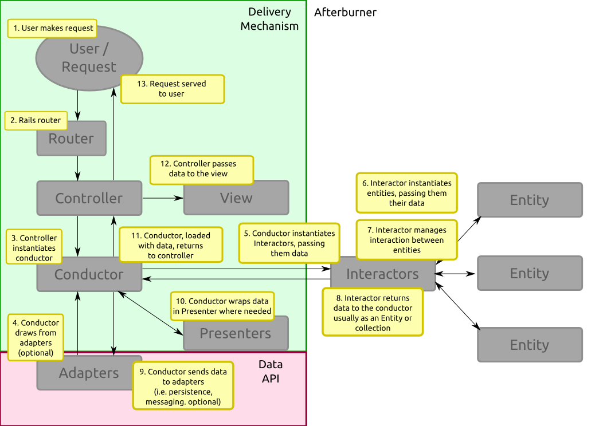

# Architecture

Afterburner CMS isn't built like your typical Rails app. At the risk of sounding scary, the problems it attempts to surmount are quite complicated, and so it requires a bit more underpinning than your standard Rails application.

## Gentle Encouragement

The architecture of Afterburner is quite a bit different from Rails. It may seem like you're not making progress, or like it takes twice as many files to write an extension for Afterburner as it does for a Rails app.

Keep two things in mind:

1. When you're learning something new, it's natural that things will take a bit longer;
2. Afterburner shifts code out of controllers and models and into intermediate objects. You might wind up creating more files, but these files will be simpler and will make it easier to add, change, test, and refactor your code in the future. So, yes, you do have to create and program a few extra files, but the pay-off is worth it once you begin to climb beyond a rudimentary level of complexity. Please trust us there.

## Introduction

Afterburner adopts a somewhat-compliant version of [Hexagonal Architecture](http://alistair.cockburn.us/Hexagonal+architecture), and is influenced both by the [Obvious Architecture](http://obvious.retromocha.com), and also heavily by Bob Martin's [Clean Architecture](http://blog.8thlight.com/uncle-bob/2012/08/13/the-clean-architecture.html). In short:

- All of Afterburner's application/business logic resides inside `/core`;
- Afterburner's user-side interfaces and APIs are stored in `/delivery`;
- Afterburner's data-side interfaces and APIs are inside `/adapters`.

### I'm Reading the Words But They Don't Make Sense

There are a few weighty terms in there, yes. You could try [watching a video about it](http://confreaks.com/videos/759-rubymidwest2011-keynote-architecture-the-lost-years).

### Application (Business Logic)

In [The Problem with solutions](http://blog.mattwynne.net/2013/01/17/the-problem-with-solutions/) Matt Wynne explains the split between what your application -- sometimes referred to 'business', 'business logic', or the 'domain' -- and the rest actually is. As he says:

> In any software project, there are two main domains: the problem domain and the solution domain. The problem domain is where your customers live. The programmers and other technicians working on solving that problem operate in the solution domain.

> [...] David West’s *Object Thinking* eloquently describes the natural divide between these two domains, and the problems it causes. In his view, our job as programmers is to build a model of the problem, and allow a solution to naturally fall out of that model. As soon as we start thinking in solutions, we lose sight of the problem and create ugly solutions. This implies that, as programmers, we need to immerse ourselves in the problem domain.

To elaborate, our problem domain is that functioning model of a problem. The solution domain is the actual technical implementation. As it turns out, we can write and reason about the problem domain in a rather simple language -- Ruby. In detailing the actual entities or things that exist in our problems and describing the interactions between them, we can actually write a solution to a problem that doesn't concern itself with implementation details, such as how we save data or how we display it. 

This can be somewhat hard to grasp. Imagine doing an addition problem in your head. You're given two numbers (it doesn't really matter which), and you simply add them and get an answer that's another number. What you don't care about when doing that calculation is where you get the numbers, or what you're going to do with the number; those are details that happen before and after the actual calculation that are fundamentally immaterial to the problem you're looking to solve.

Likewise, when we're programming, we can divide our code into two sections: the application, which is the calculation part, and all the other stuff that isn't really so much about solving the problem as it is about responding and interacting properly.

Keep in mind that the terms 'business' and 'application' are loaded with semantic meaning, so this may not jive easily with your concept of what they are. If you're experiencing some cognitive friction, I encourage you to read Matt's blog post above. I also encourage you *not* to read Wikipedia on the subject, as it's not technically correct. Instead, find an hour and check out Bob Martin's [Architecture: The Lost Years](http://www.youtube.com/watch?v=WpkDN78P884), which may have the unforeseen consequence of blowing your mind.

### User-Side API (Delivery Mechanisms)

Plain and simple, a user-side API is an interface that accepts requests from a user, which elicit responses from the application, and then optionally displays some output to the user.

For instance, Afterburner implements two Rails apps which we call `frontend` and `backend` that accept requests through HTTP (a web browser), interact with the application and the database, and then displays results to the user through their web browser.

You might also interact with the JSON API, which does much the same thing, only returning a much more human-unfriendly response, which is often used to plug into other programs.

### Data-Side API

The data-side API is an API that a user will never directly interact with, but other delivery mechanisms might. For instance, when loading a page through the frontend API, our delivery mechanism might want to load data from a database. The user will never directly interface with the database, though. Or there might be a data-side API that the delivery mechanism uses to post to Reddit in certain circumstances.

What is worth noting is that the application should never respond to anything from something data-side. It may query for information and use that information, but nothing in the data-side API will ever initiate an interaction with the application.

### Summary

Perhaps the most important thing to note about Afterburner's architecture is that it's designed to keep the concerns of the software separate. This means that it takes some pains to make sure that the business part of the software doesn't depend on a specific database, and doesn't explicitly tie itself to any set of presentation. It also means that inner layers of the application don't know or make any judgments about the outer layer. (If you're confused as to what this means, we highly recommend you read the above link to Bob Martin's *Clean Architecture* or *Architecture: The Lost Years*.)

The benefits of this are manifest: it means that swapping between datastores should take only a few minutes' work, and it means that you should be able to extract data from Afterburner in any way you can think of without being tied to one interface. It also means that the tests are simpler to write, and--once you learn the new architecture--writing complicated extensions is actually much easier, even though simple ones might take a bit more time than your standard Rails app. (Afterburner provides tools to deal with that, too.)

And that's the theory!

## Sections

It's sometimes easier to see a visualization of the whole thing.

### Business Logic

Business logic is the part of the application that deals with use cases of the system, which in turn detail the interplay of entities.

#### Entities

In Rails, our models are our chief entities. In Afterburner, our entities share some similarities to models, but they don't save like ActiveRecords do in Rails. Instead, they're utterly unconcerned with it; they just accept data and manipulate it. These entities reside in `/core/entities`. They're also further subdivided by their function, so all the entities pertaining to menus are in `/core/entities/menu`, for example.

#### Interactors

Inside our business logic, we also have what are called Interactors. These are use case objects. In short, though, they are Plain Old Ruby Objects (*POROs*) that take some data as arguments, transforms it into entities, maybe manipulates the entities, and then returns some data -- an entity or otherwise -- to its caller. They provide a logical way to group the functionality or use cases of Afterburner (and of your application, too) *as it relates to the business logic of the app*. Note that this is not the layer that interfaces with either user- or data-facing APIs; it just implements the sometimes-complex rules that govern the relationships between the entities. These are stored inside `/core/interactions`.

### Delivery

As we said earlier, our methods of delivery are separate from our business logic. There's quite a few default methods of delivery, but, of course, you can write your own. The folders in `/delivery` each implement a different user-facing API. In some cases, these are quite simple and conform to what we *think* of as APIs -- for example, there's an `api` folder that implements a JSON API -- but there's also a `frontend` and a a `backend` folder that implement the front-end and the back-end HTML APIs that you can consume through your web browser.

There's a lot of power in this. You can write your own delivery mechanisms, too. For example, you might want to make Afterburner handle input from a serial port (perhaps you have a card reader that is used to update a balance somewhere). You'd write a controller to handle the incoming request, and to fire off a Conductor, which interfaces with the actual business logic and potentially with other APIs (updating a record in the database, for example).

You can write your delivery mechanisms any way you want, of course, but Afterburner's default delivery mechanisms have a few commonalities:

- Views are stored in `app/views`;
- Controllers are located in `app/controllers`;
- Presenters (sometimes known as ViewModels) are located in `app/presenters`;
- Conductors (sometimes known as Domain Controllers) are located in `app/conductors`;

#### Views

What the views look like is highly dependent on the delivery mechanism. Most of the time, these will be standard Rails views, except they'll be frequently be passed Presenters, not only raw objects. In other situations, these views might look very different, or they might even be non-existent.

#### Controllers

Controllers can also vary depending on the mechanism, though they're usually either a PORO or a ActionController object. On the face of things, controllers behave like simplified Rails controllers. Their job is to receive a request and decide depending on parameters which Conductor should be instantiated to handle the application flow. The controller also handles assigning the Conductor's response to an appropriate variable to pass to the template, as well as which view or layout should be rendered.

Note that the controller is NOT responsible for retrieving models, nor is it responsible for ensuring that they have successfully saved. The former is the responsibility of the Conductor, and the latter is the responsibility of something called a Repository. More on that later, though!

#### Presenters

Presenters are objects that take data structures as arguments and then expose methods to present that data in appropriate formats. For example, we have an `Html::MenuPresenter` that takes a `Menu` entity and its associations and exposes a `to_html` method that allows you to turn that data structure into an HTML tree. It also exposes methods to specify classes, IDs, and even to change the wrapper elements, as well as methods to limit the depth that the tree is output. This is a somewhat weird example; most presenters will just expose methods that you can call in your views to easily move complex logic into a more testable, encapsulable spot.

#### Conductors

What we call Conductors are sometimes called Services, sometimes called Domain Controllers, sometimes called Facade Controllers. We chose to call them 'Conductors' because 'Service' is usually applied to a hybrid between Conductors and Commands, and in order to avoid confusion between types of controllers. Nevertheless, they function as Domain Controllers, which is to say that they create and call Interactors, wrap that response in appropriate Presenters, and then return those to the Controller. In some cases, they will check in or withdraw data to or from a Repository (which handles persistence/database interaction) and pass this into a use case, or sometimes access other data-facing APIs, too.

If you'd like to do a bit more reading as to why these are valuable, Nicholas J. Henry gives a good outline in [Your Rails Application is Missing a Domain Controller](http://blog.firsthand.ca/2011/12/your-rails-application-is-missing.html) -- just note that we make a distinction between Facade Controllers and Use Case Controllers, the latter of which is an Interactor in our architecture.

### Adapters

Of all three of the sections, this is the most disparate section. Adapters are divided by folder, but data-facing APIs tend to be rather eclectic. You might have a folder in here that deals with an interface to the database, as well as a folder that contains an interface to socket-write to IRC, or to post to another REST API.

So the crucial difference between Adapters and Deliveries, then, is that Deliveries have the capacity to send requests to Afterburner, whereas Adapters can only receive requests from Afterburner. Adapters can retrieve results and pass it back to the application, but they don't actually return any information to the user. That responsibility falls to a delivery mechanism.

You'll note that this is slightly different from standard Hexagonal practice, whereby incoming requests from any quarter would be handled by what it calls an adapter, and any outgoing data would be handled by what they call a port. Unfortunately, we're somewhat constrained by Rails controllers which are hybrid ports *and* adapters, so in order to be consistent, we follow that hybridity on an architectural scale, and we will continue to do so until we have a better alternative.

We have several default sections in Afterburner:

#### Persistence

This deals with saving data so that it can be reused later. This includes a few subsections:

##### Repositories

Repositories are objects that deal with taking raw data and converting it into a format appropriate for the database, as well as persisting it; and vice versa, too. This is one of the spots where you'll frequently work when you create custom extensions. They are kept in `adapters/persistence/repositories`.
